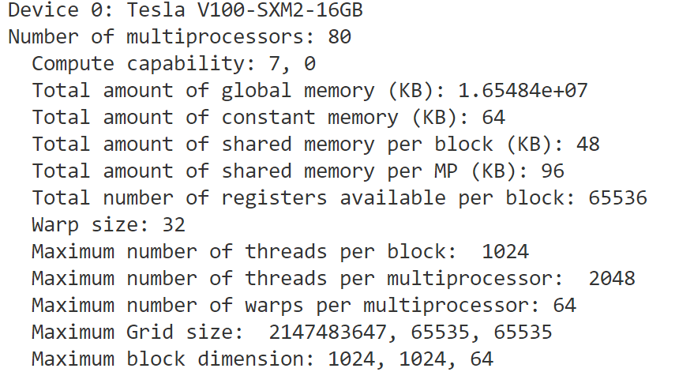
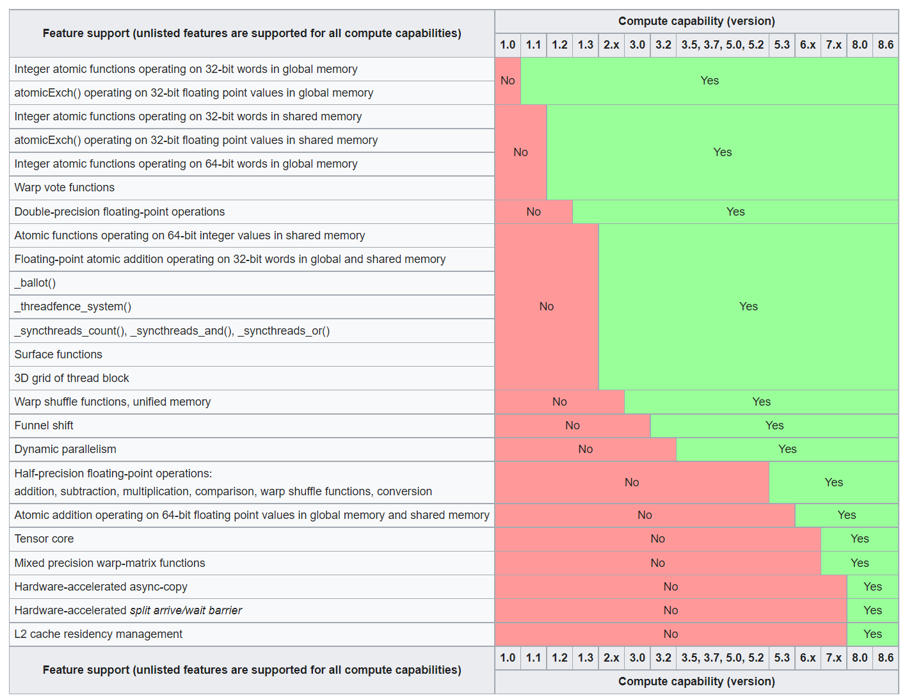

## Device properties
For the device at hand, we can get the capabilities as listed below by running the example from this directory. 

## Compute capability
The compute capability is the "feature set" (both hardware and software features) of the device. You may have heard the NVIDIA GPU architecture names "Tesla", "Fermi" or "Kepler". Each of those architectures have features that previous versions might not have. The compute capability is your CUDA device's set of computation-related features. As NVidia's CUDA API develops, the 'Compute Capability' number increases. 

| Property | Explanation |
| ------------- | ------------- |
| Name  |Ascii string identifying the device  |
| Major/minor  | Major and minor revision numbers defining device's compute capability  |
|totalGlobalMem | total amount of global memory available on the device in bytes|
|maxThreadsPerBlock|maximum number of threads per block|
|maxThreadsDim[3]|maximum size of each dimension of a block|
|maxGridSize[3]|maximum size of each dimension of a grid|
|clockRate|clock frequency in kilohertz|
|sharedMemPerBlock|maximum amount of shared memory available to a thread block in bytes|
|Warp size|warp size for device|
