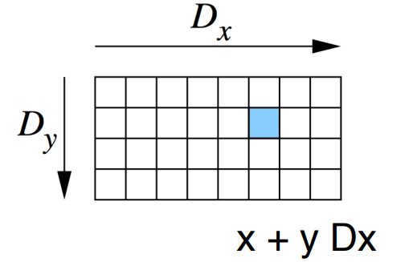

- [Grid block and threads in a block](#grid-block-and-threads-in-a-block)
- [Organization of threads in different dimensions](#organization-of-threads-in-different-dimensions)

  - [Calling a kernel](#calling-a-kernel)
  - [Limitation on the number of threads](#for-a-given-thread-block-the-limitation-on-the-number-of-threads-in-each-dimension-are-as-follows)
  - [Maximum number of blocks in each dimension](#a-grid-can-have-a-maximum-of-following-number-of-blocks-in-each-dimension)
  - [Calcuating the global index in a 2D grid](#calcuating-the-global-index-in-a-2d-grid)
- [CUDA memory transfer](#cuda-memory-transfer)

## Grid block and threads in a block
- Threads are organized in blocks; blocks are grouped into a grid; and threads are
executed in kernel as a grid of blocks of threads; all computing the same function.
- Each block is a 3D array of threads defined by the dimensions: $Dx, Dy$, and $Dz$,
 which you specify.
- Each thread has a thread index, threadIdx: $(x,y,z)$;
 $0 \le x < Dx$, $0 \le y < Dy$, $0 \le z < Dz$, where $Dx, Dy, Dz$ are the block dimensions; $Dx \times Dy \times Dz$ = max threads per block.
- Each thread also has a thread id: threadId = $x + y Dx + z Dx Dy$. The threadId is like 1D representation of an array in memory
- If you are working with $1$D vectors, then $Dy$ and $Dz$ could be zero. Then
threadIdx is $x$, and threadId is $x$. Working with $2$D arrays, then $Dz$ would be zero.

## Organization of threads in different dimensions
### 1D


For one block, the unique threadId of thread of index (x) = x, ```threadIdx.x =x```

### 2D


In $2$-D, with block of size $(Dx, Dy)$, the unique threadId of thread with index (x,y): threadId= x + y Dx, ```threadIdx.x = x; threadIdx.y = y```

### 3D


In 3-D, with block of size (Dx,Dy, Dz), the unique threadID of thread with index (x,y,z): threadId = x+y Dx + z Dx Dz, ```threadIdx.x = x; threadIdx.y = y; threadIdx.z = z```


Total number of threads = Thread_per_block* Number of blocks

### Calling a kernel

```kernel_name<<<number_of_blocks, threads_per_block>>>(arguments()```
The arrangement of a grid is configured by these first 2 kernel launch parameters. First kernel launch paramter configures how many thread blocks in each dimension and second parameter specifies how many threads in a block in each dimention. 

There are 2 ways to specify these dimensions:
- A single integer defines in one dimension only
- A dim3 defines in 3 dimensions


```dim3 variable_name(x,y,z)```

You can access each dimension of the ```dim3``` variable by 
```
- variable_name.x
- variable_name.y
- variable_name.z
```


### For a given thread block, the limitation on the number of threads in each dimension are as follows:
```
- x<=1024
- y<=1024
- z<=64
- x * y * z < 1024
```

### A grid can have a maximum of following number of blocks in each dimension
```
- x < 2^32-1
- y < 65536
- z < 65536
```

### Calcuating the global index in a 2D grid

```
row_offset = gridDim.x * blockDim.x * blockIdx.y
block_offset = blockIdx.x * blockDim.x
gid = row_offset + block_offset + threadIdx.x
```

## CUDA memory transfer

```
cudaMemcpy(destination ptr, source ptr, size in bytes, direction)
```

Direction
- Host to device - cudamemcpyhtod
- Device to host - cudamemcpydtoh
- Device to device - cudamemcpydtod

