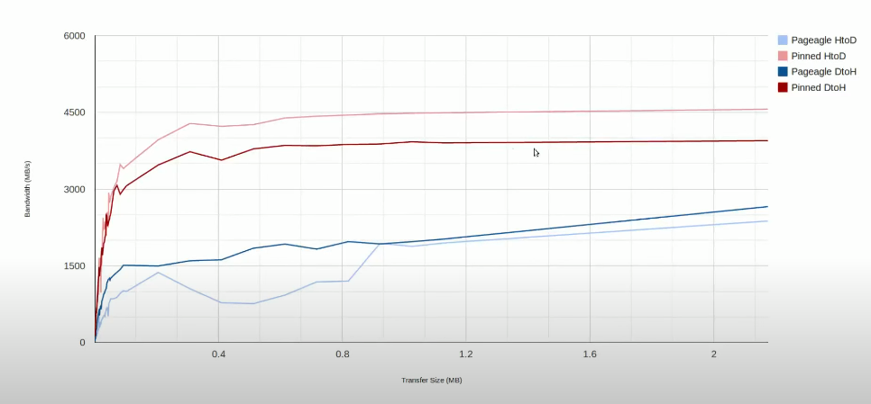
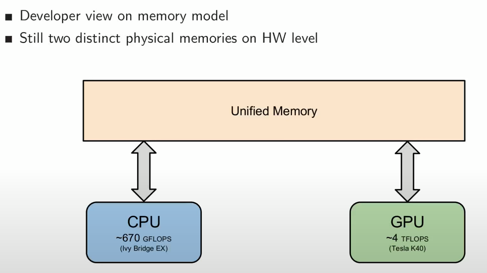

```kernel_name<<<number_of_blocks, threads_per_block>>>(arguments()```
The arrangement of a grid is configured by these first 2 kernel launch parameters. First kernel launch paramter configures how many thread blocks in each dimension and second parameter specifies how many threads in a block in each dimention. 

There are 2 ways to specify these dimensions:
- A single integer defines in one dimension only
- A dim3 defines in 3 dimensions


```dim3 variable_name(x,y,z)```

You can access each dimension of the ```dim3``` variable by 
```
- variable_name.x
- variable_name.y
- variable_name.z
```


### For a given thread block, the limitation on the number of threads in each dimension are as follows:
```
- x<=1024
- y<=1024
- z<=64
- x * y * z < 1024
```

### A grid can have a maximum of following number of blocks in each dimension
```
- x < 2^32-1
- y < 65536
- z < 65536
```

### Calcuating the global index in a 2D grid

```
row_offset = gridDim.x * blockDim.x * blockIdx.y
block_offset = blockIdx.x * blockDim.x
gid = row_offset + block_offset + threadIdx.x
```

## CUDA memory transfer

```
cudaMemcpy(destination ptr, source ptr, size in bytes, direction)
```

Direction
- Host to device - cudamemcpyhtod
- Device to host - cudamemcpydtoh
- Device to device - cudamemcpydtod


## Data transfers
The CPU and the GPU have its own memory space with solid memory bandwidth. Obviously the weakest link is the interconnection between the CPU and the GPU. PCIE provides a bandwidth of 8GB/s in the ideal case but in practise it could be lower. 

## When GPU <-> CPU memory transfers are performed?


## Types of data transfers


### Difference between pageable and pinned memory
When you allocate memory in host code, the allocations are pageable by default, which means it can be swapped to disk. So our data may not be present in a physical memory when the transfer to device is requested. On the other hand, pinned memory is allocated within the kernel memory space which cannot be swapped and therefor such data are always physically present in the memory. When a regular memory transfer is issued and allocation of page locked memory is necessary.

When a regular memory is requested on the host, a space is created in the pge locked memoery, memory is copied to page locked memory, the host is blocked while the transfer takes place, and once the transfer is complete, the regular memory space is deleted. This could be an overhead. However, with pinned memory the data is always accessible. 



That is why peak transfer rates with pinned memory are higher compared to transfer rates of regular memory since it avoids additional implicit memcopies within the host memory. 

Allocation is done using ```cudaMallocHost``` as shown here


### Summary


You should not over allocate pinned memory since it reduces the amount of physical memory available for kernel/operating system. In such cases, the system could become unstable. 

### Performance of Unified Virtual Memory (introduced in CUDA 6)
Developer views the memory as if there is only one shared memory between host and device. However, at the hardware level, there are 2 distinct spaces. 




Performance is degraded as data transfer occurs over multiple small data transfers when it is requested from the host. It introduced latency and also poor bandwidth. 


### Asynchronous data transfer
For async transfer, the data needs to be on pinned memory so that there are no page faults. It can then be copied by using streams.


### CUDA streams


Follow this link for an explanation of memory transfers: 
[](https://www.youtube.com/watch?v=Yv4thF9tvPo&t=8s)
