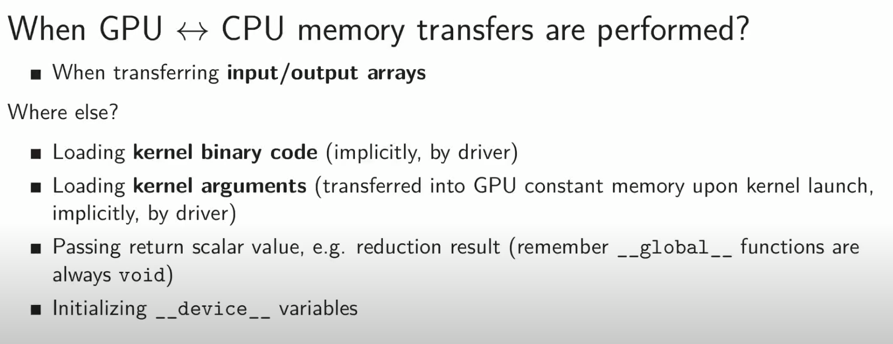

```kernel_name<<<number_of_blocks, threads_per_block>>>(arguments()```
The arrangement of a grid is configured by these first 2 kernel launch parameters. First kernel launch paramter configures how many thread blocks in each dimension and second parameter specifies how many threads in a block in each dimention. 

There are 2 ways to specify these dimensions:
- A single integer defines in one dimension only
- A dim3 defines in 3 dimensions


```dim3 variable_name(x,y,z)```

You can access each dimension of the ```dim3``` variable by 
```
- variable_name.x
- variable_name.y
- variable_name.z
```


### For a given thread block, the limitation on the number of threads in each dimension are as follows:
```
- x<=1024
- y<=1024
- z<=64
- x * y * z < 1024
```

### A grid can have a maximum of following number of blocks in each dimension
```
- x < 2^32-1
- y < 65536
- z < 65536
```

### Calcuating the global index in a 2D grid

```
row_offset = gridDim.x * blockDim.x * blockIdx.y
block_offset = blockIdx.x * blockDim.x
gid = row_offset + block_offset + threadIdx.x
```

## CUDA memory transfer

```
cudaMemcpy(destination ptr, source ptr, size in bytes, direction)
```

Direction
- Host to device - cudamemcpyhtod
- Device to host - cudamemcpydtoh
- Device to device - cudamemcpydtod


## Data transfers
The CPU and the GPU have its own memory space with solid memory bandwidth. Obviously the weakest link is the interconnection between the CPU and the GPU. PCIE provides a bandwidth of 8GB/s in the ideal case but in practise it could be lower. 

## When GPU <-> CPU memory transfers are performed?





Follow this link for an explanation of memory transfers: 
[](https://www.youtube.com/watch?v=Yv4thF9tvPo&t=8s)
