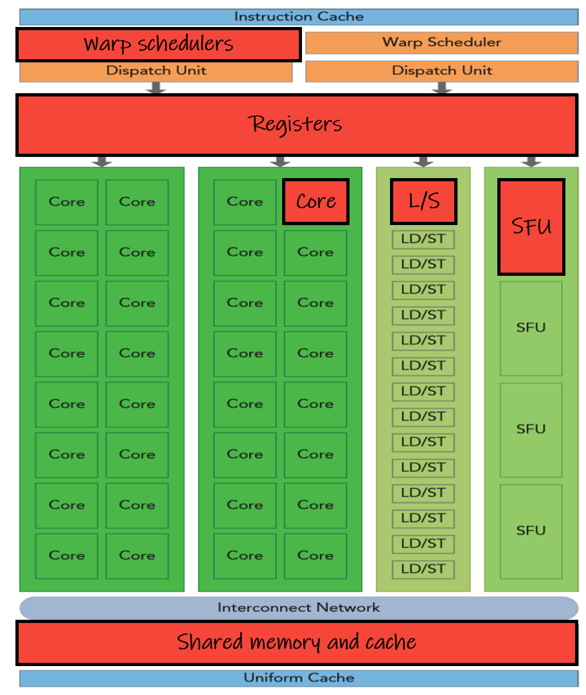

## ON chip components

- CUDA cores (FP32, FP64, INT, Tensor cores)
- Shared memory and L1 cache
- Registers
- Load/Store units
- warp schedulers
- Special function units



# Warps
- A warp is a set of 32 threads within a thread block such that all the threads in a warp execute the same instruction. These threads are selected serially by the SM. Once a thread block is launched on a multiprocessor (SM), all of its warps are resident until their execution finishes.

```threadId = threadIdx.x+blockDim.x*(threadIdx.y+blockDim.y*threadIdx.z)```. Every 32 threads of this index is a new warp.

- Number of warps per block = Block size / warp size. Here block size is the number of threads in each block and warp size is 32.

- Resource allocations like shared memory for block will be done considering number of warps

- Having inactive threads in warp will be a great waste of resource in streaming multiprocessor (SM)