## Different memory types
Local, Global, Constant, and Texture memory all reside off chip. Local, Constant, and Texture are all cached. Each SM has a L1 cache for global memory references. All SMs share a second L2 cache. Access to the shared memory is in the TB/s. Global memory is an order of magnitude slower. Each GPS has a constant memory for read only with shorter latency and higher throughput. Texture memory is read only.


| Type | Read/write | Speed |
| ------------- | ------------- |------------|
| Global memory  | read and write  | slow, but cached |
| Texture memory | read only | cache optimized 2D/3D access pattern |
| Constant memory | read only | where contants and kernel arguments are stored | 
| Shared memory | read/write | fast | 
| Local memory | read/write | used when it does not fit in registers, part of global memory, slow but cached |
| Registers | read/write | fast | 

Local memory is just thread local global memory. It is much slower than either registers or shared memory.

Speed (Fast to slow):

- Register file
- Shared Memory
- Constant Memory
- Texture Memory
- (Tie) Local Memory and Global Memory


| Declaration | Memory | Scope | Lifetime |
| ------------- | ------------- |------------|---------|
| ```int v```  | register  | thread | thread |
| ```int vArray[10]``` | local | thread | thread |
| ```__shared__ int sharedV``` | shared | block | block |
| ```__device int globalV```   | global | grid | application |
| ```__constant__ int constantV ``` | constant | grid | application |

## Shared memory
Shared memory is on-chip and is much faster than local and global memory. Shared memory latency is roughly 100x lower than uncached global memory latency. Threads can access data in shared memory loaded from global memory by other threads within the same thread block. Memory access can be controlled by thread synchronization to avoid race condition (```__syncthreads```). Shared memory can be used as user-managed data caches and high parallel data reductions.

The ```__syncthreads()``` is light weighted and a block level synchronization barrier. ```__syncthreads()``` ensures all threads have completed before continue.

## Page-locked (pinned) memory
- CPU can access larger data sets than their memory can hold by implementing a virtual memory system (non-locked memory).
- Pages of memory can be temporarily saved on disk and swapped in and out when needed. 
- When data is needed by GPU, it is copied to a page-locked pinned memory buffer
and passed to Direct Memory Access.
- The cost is the time to copy the data to pinned memory, the data transfer, and the deletion of page-locked memory.
- There is usually enough space on the CPU to use page-locked memory; then the
DMA is made to GPU without involving the CPU. 

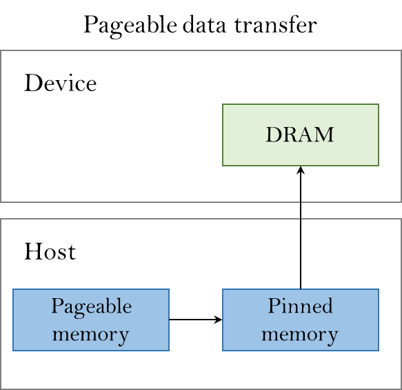

versus 

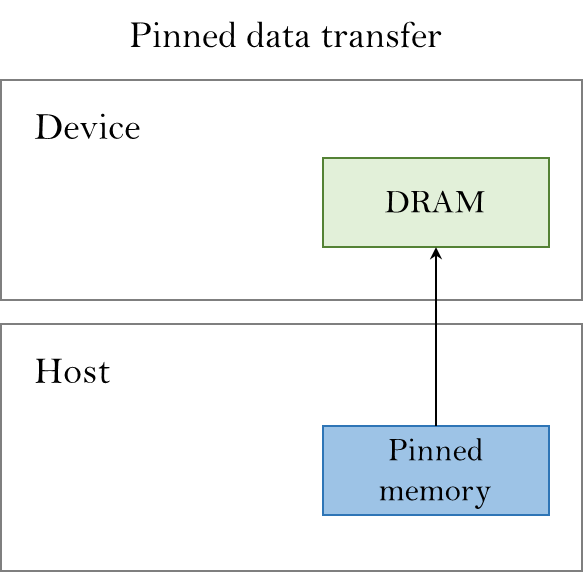


## Shared memory 
- Very fast, accessible to all threads in block
- Example: threads in same block can access data obtained by global memory by other threads in the block
- Need to be careful of race conditions. These occur because threads are grouped by
32 thread bundles called warps for execution. If thread a and b read data from global
memory and save as shared memory. Then thread a want to read b’s element in
shared memory. If a and b are in different warps, then b may not be done writing
before a wants to read it.

```__syncthreads(); //to provide a barrier in block```


## CUDA memory transfer

```
cudaMemcpy(destination ptr, source ptr, size in bytes, direction)
```

Direction
- Host to device - cudamemcpyhtod
- Device to host - cudamemcpydtoh
- Device to device - cudamemcpydtod


## Data transfers
The CPU and the GPU have its own memory space with solid memory bandwidth. Obviously the weakest link is the interconnection between the CPU and the GPU. PCIE provides a bandwidth of 8GB/s in the ideal case but in practise it could be lower. 

## When GPU <-> CPU memory transfers are performed?

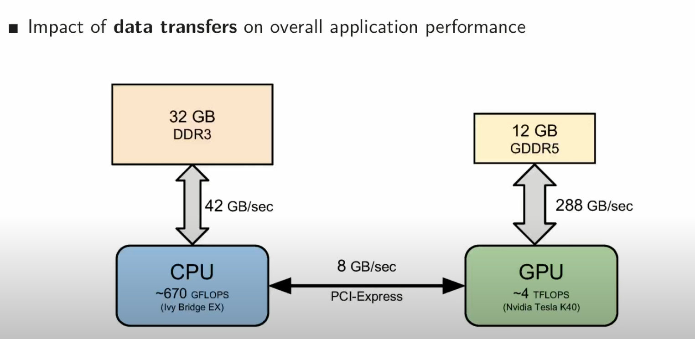
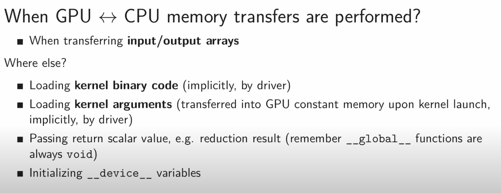

## Types of data transfers
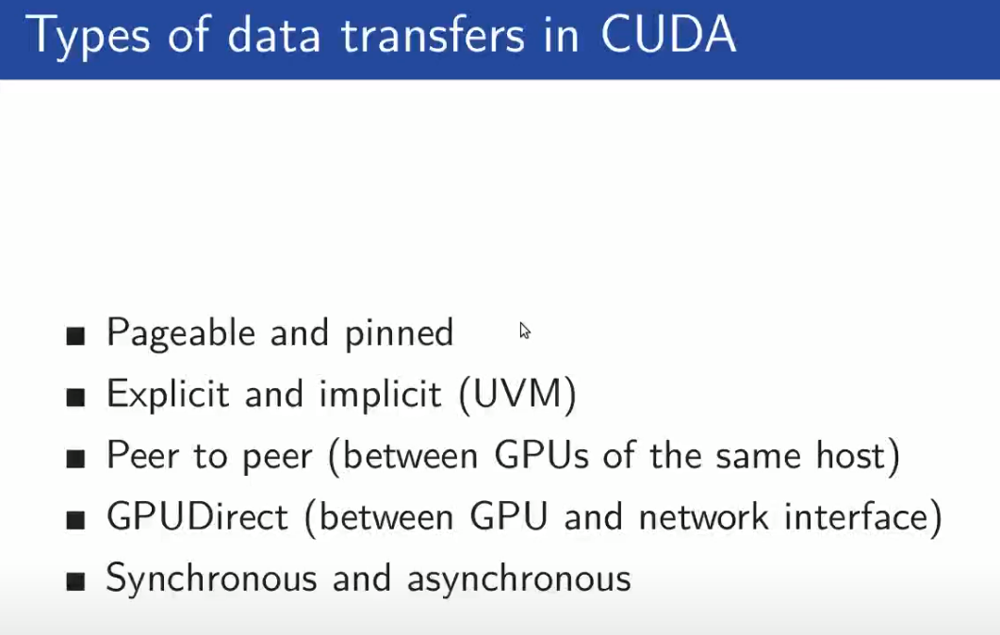

### Difference between pageable and pinned memory
When you allocate memory in host code, the allocations are pageable by default, which means it can be swapped to disk. So our data may not be present in a physical memory when the transfer to device is requested. On the other hand, pinned memory is allocated within the kernel memory space which cannot be swapped and therefor such data are always physically present in the memory. When a regular memory transfer is issued and allocation of page locked memory is necessary.

When a regular memory is requested on the host, a space is created in the pge locked memoery, memory is copied to page locked memory, the host is blocked while the transfer takes place, and once the transfer is complete, the regular memory space is deleted. This could be an overhead. However, with pinned memory the data is always accessible. 


That is why peak transfer rates with pinned memory are higher compared to transfer rates of regular memory since it avoids additional implicit memcopies within the host memory. 

Allocation is done using ```cudaMallocHost``` as shown here
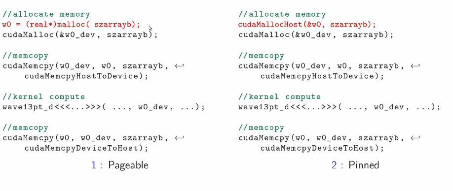

### Summary

- Pageable memory - user memory space, requires extra mem-copy
- Pinned memory - kernel memory space
- Pinned memory performs better (higher bandwidth)
- Do not over-allocate pinned memory - reduces amount of physical memory available for OS

You should not over allocate pinned memory since it reduces the amount of physical memory available for kernel/operating system. In such cases, the system could become unstable. 

### Where are local variables stored?
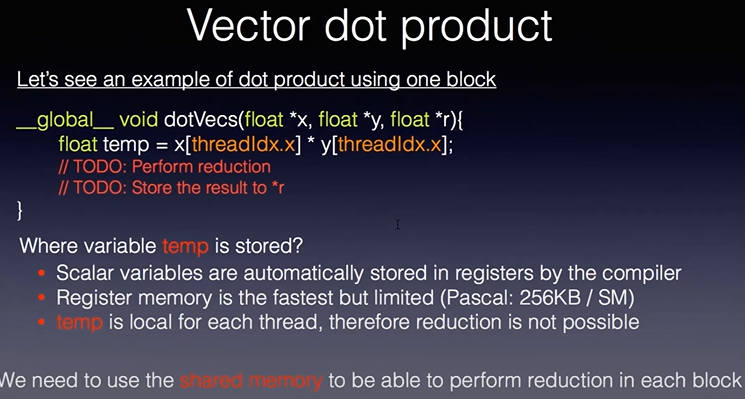

Local variables are stored in registers. It is local to each thread and is not shared with neighboring threads.


### Performance of Unified Virtual Memory (introduced in CUDA 6)
Developer views the memory as if there is only one shared memory between host and device. However, at the hardware level, there are 2 distinct spaces. 

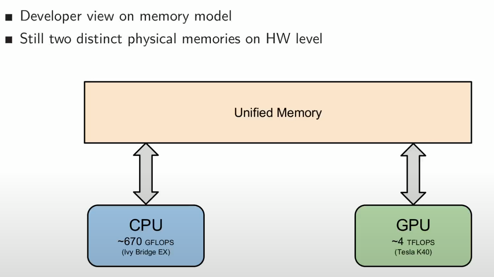

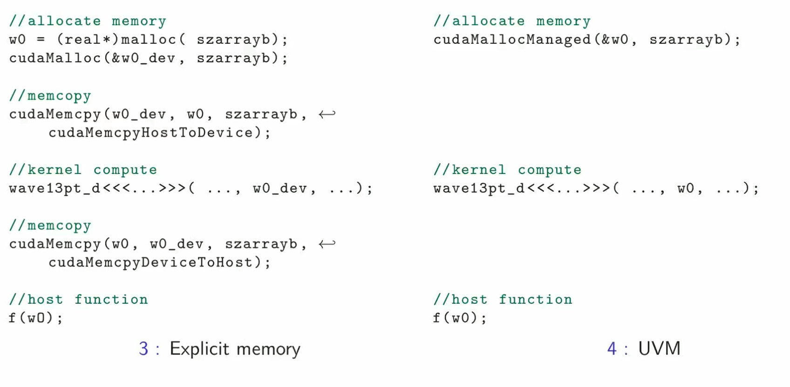

Performance is degraded as data transfer occurs over multiple small data transfers when it is requested from the host. It introduced latency and also poor bandwidth. 
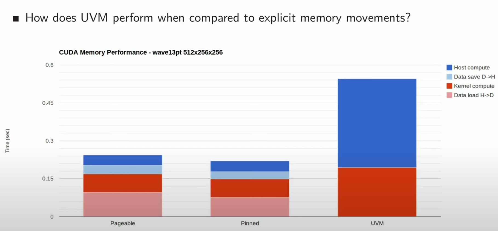


### Asynchronous data transfer
For async transfer, the data needs to be on pinned memory so that there are no page faults. It can then be copied by using streams.

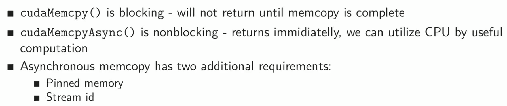
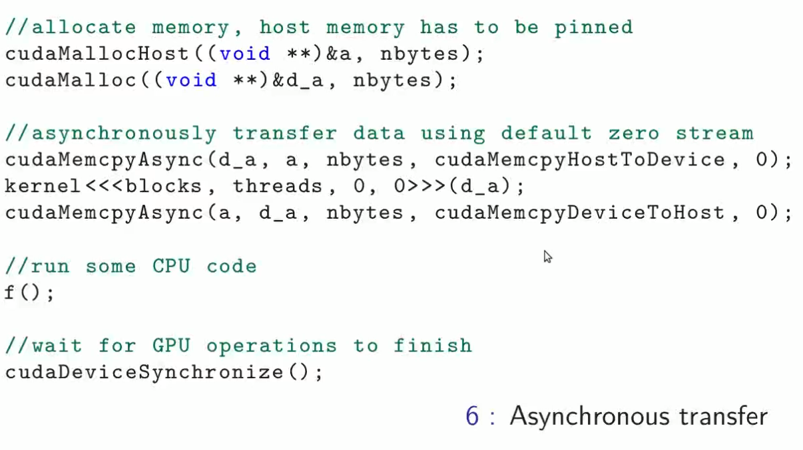

### CUDA streams
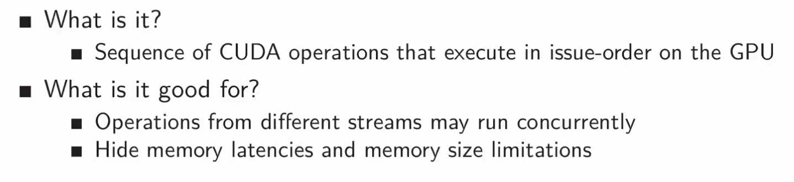

### Device management
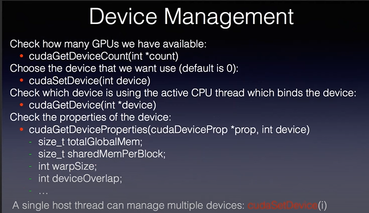


Follow this link for an explanation of memory transfers: 
[](https://www.youtube.com/watch?v=Yv4thF9tvPo&t=8s)

[](https://www.youtube.com/watch?v=0wf_y5fVbP0)

[](https://github.com/khadjiyiannakou/trainCuda)
