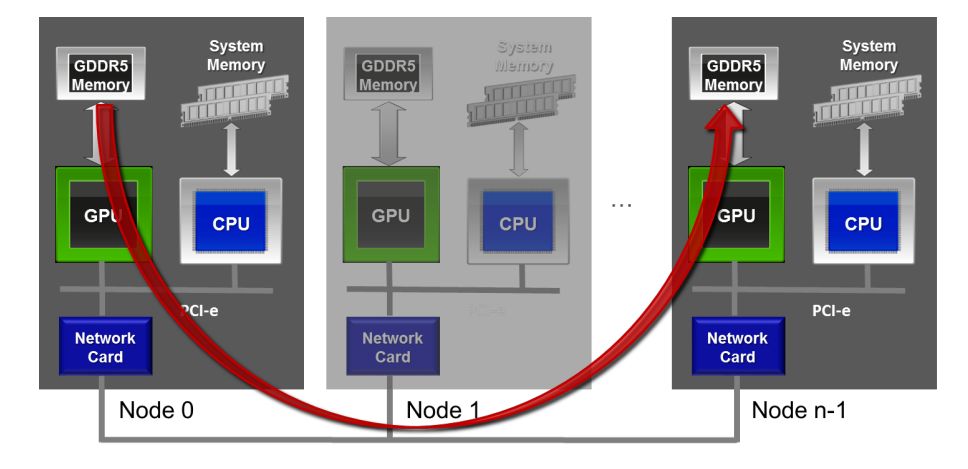

## MPI

In the following example, pointers to host (system) memory are passed to the MPI calls. With a regular MPI implementation only pointers to host memory can be passed to MPI.

```
    char message[20];
    if (myrank == 0) {
        // Send
        MPI_Send(message, strlen(message)+1, MPI_CHAR, 1, tag, MPI_COMM_WORLD);
    } else {
        // Receive
        MPI_Recv(message, 20, MPI_CHAR, 0, tag, MPI_COMM_WORLD, &status);
    }
```

## CUDA aware MPI
CUDA aware MPI implementations allow GPU memory buffers to be passed directly to MPI function calls, eliminating the need to manually copy GPU data to the host before passing data through MPI. 
If you are combining MPI and CUDA, you often need to send GPU buffers instead of host buffers. Without CUDA-aware MPI, you need to stage GPU buffers through host memory, using cudaMemcpy as shown in the following code excerpt.

```
//MPI rank 0
cudaMemcpy(s_buf_h,s_buf_d,size,cudaMemcpyDeviceToHost);
MPI_Send(s_buf_h,size,MPI_CHAR,1,100,MPI_COMM_WORLD);

//MPI rank 1
MPI_Recv(r_buf_h,size,MPI_CHAR,0,100,MPI_COMM_WORLD, &status);
cudaMemcpy(r_buf_d,r_buf_h,size,cudaMemcpyHostToDevice);
```

With a CUDA-aware MPI library this is not necessary; the GPU buffers can be directly passed to MPI as in the following excerpt.
```
//MPI rank 0
MPI_Send(s_buf_d,size,MPI_CHAR,1,100,MPI_COMM_WORLD);

//MPI rank n-1
MPI_Recv(r_buf_d,size,MPI_CHAR,0,100,MPI_COMM_WORLD, &status);
```

## GPU direct

GPUDirect for accelerated communication with network and storage devices allows the network fabric driver and the CUDA driver to share a common pinned buffer in order to avoids an unnecessary memcpy within host memory between the intermediate pinned buffers of the CUDA driver and the network fabric buffer.



## References
[CUDA aware MPI](https://developer.nvidia.com/blog/introduction-cuda-aware-mpi/)
[MULTI GPU PROGRAMMING (WITH MPI)](https://fisica.cab.cnea.gov.ar/gpgpu/images/charlas/multi_gpu_programming_with_mpi.pdf)